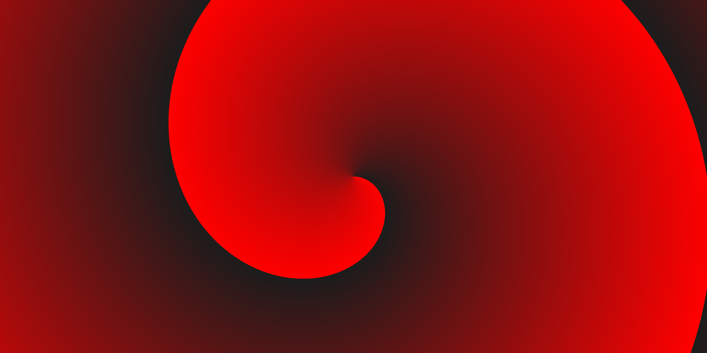
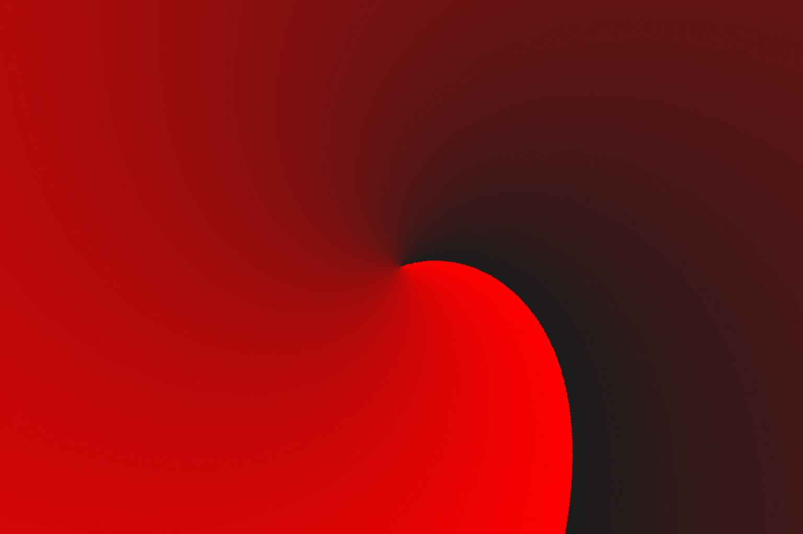
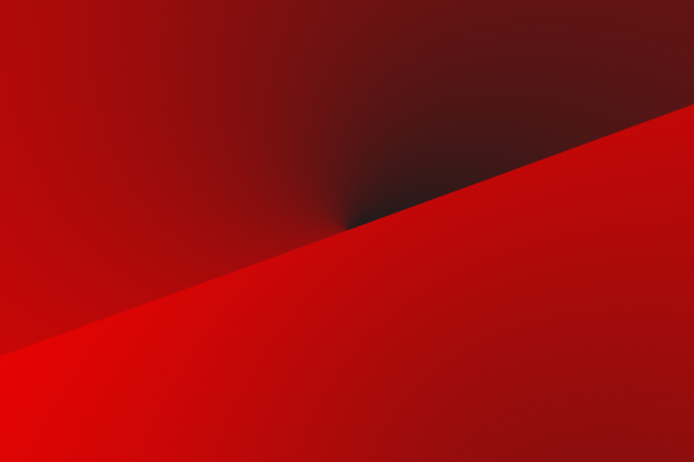
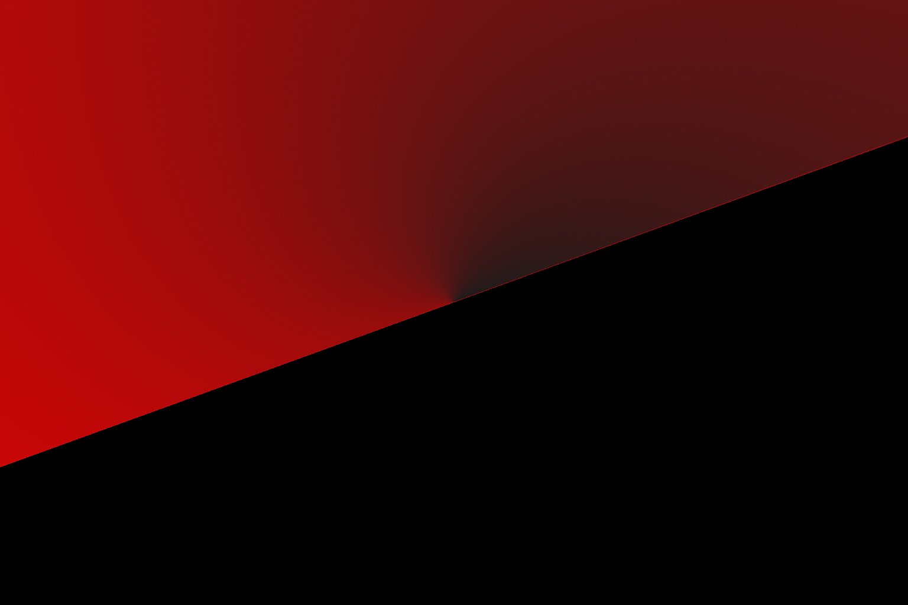

# Equilib-Wrapper
A simple wrapper for the [pyequilib](https://github.com/haruishi43/equilib/) library that simplifies some syntax and adds some features.

## Installation
```bash
pip install git+https://github.com/Christophernph/equilib-wrapper.git
```

## Usage
Given an input panorama as shown below, we can convert it to a perspective image using the `equi2pers` function.



```python
from equilib_wrapper import equi2pers
import numpy as np

equi = Image.open("assets/panorama.png").convert("RGB")
equi = np.asarray(equi).transpose(2, 0, 1) # expects channels first

# parameters
height = 1024
width = 1536
hfov = 90
rotation = np.array([20, 0, 0]) # roll, pitch, yaw

# convert
result = equi2pers(
    equi,
    height,
    width,
    hfov=hfov,
    degrees=True, # all parameters are in degrees (rotation, h/vfov, h/vrange)
)

# save
result = Image.fromarray(result.transpose(1, 2, 0))
result.save("assets/perspective.png")

```
The above code will generate the following perspective image.



It is also possible to specify the range of the equirectangular image used, e.g. if only the top-half of the panorama exists, we can specify the range as follows:

```python
from equilib_wrapper import equi2pers
import numpy as np

equi = Image.open("assets/panorama.png").convert("RGB")
equi = np.asarray(equi).transpose(2, 0, 1) # expects channels first
equi = equi[:, :equi.shape[1] // 2, :] # only use the top half

# parameters
height = 1024
width = 1536
hfov = 90
rotation = np.array([20, 0, 0]) # roll, pitch, yaw
vrange = (-90, 0) # specify range of the equirectangular image

# convert
result = equi2pers(
    equi,
    height,
    width,
    hfov=hfov,
    degrees=True,
    vrange=vrange,
)

# save
result = Image.fromarray(result.transpose(1, 2, 0))
result.save("assets/perspective_range.png")
```
The above code will generate the following perspective image.



Notice how any region outside the specified range is wrapped around the equirectangular image. If this is not desired, it is also possible to specify `fill_mode` as `pad` and then `pad_value` to the desired RGB value.

```python
from equilib_wrapper import equi2pers
import numpy as np

equi = Image.open("assets/panorama.png").convert("RGB")
equi = np.asarray(equi).transpose(2, 0, 1) # expects channels first
equi = equi[:, :equi.shape[1] // 2, :] # only use the top half

# parameters
height = 1024
width = 1536
hfov = 90
rotation = np.array([20, 0, 0]) # roll, pitch, yaw
vrange = (-90, 0) # specify range of the equirectangular image

# convert
result = equi2pers(
    equi,
    height,
    width,
    hfov=hfov,
    degrees=True,
    vrange=vrange,
    fill_mode="pad",
    pad_value=(0, 0, 0), # black fill
)

# save
result = Image.fromarray(result.transpose(1, 2, 0))
result.save("assets/perspective_pad.png")
```

The above code will generate the following perspective image.


